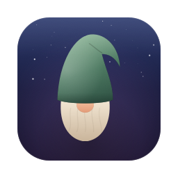
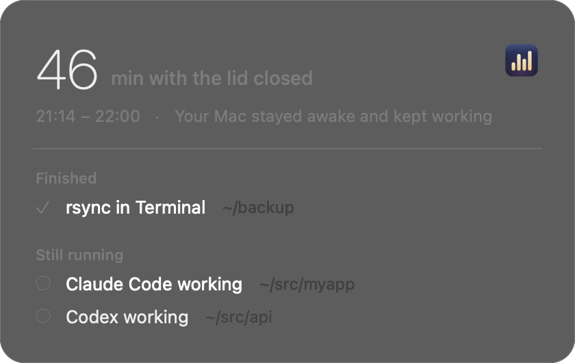

# runawake



**Keep your Mac awake only while something is actually running — AI agents or terminal commands — even with the lid closed. When you open the lid, see what finished and what is still running.**



## Features

- **Only while something runs** — AI agents while they are responding, and any foreground terminal command (rsync, builds, scripts…). Idle sessions do not keep the Mac awake.
- **Hooks optional** — works out of the box with CPU heuristics. Once an agent's hooks are seen firing, runawake switches to exact start/stop detection for that agent.
- **Lid-closed mode (optional)** — keeps working with the lid shut, and puts the Mac to sleep as soon as the work ends.
- **Safety guards** — stops keeping the Mac awake when it gets hot (stricter with the lid closed), when the battery drops to 20% (resumes when plugged in), and after 3 hours with the lid closed on battery. With the lid closed, losing the network for 3 minutes (you are on the move) also stops it, and the Mac sleeps.
- **Wake summary** — a calm card when you come back: how long the lid was closed, what finished, what is still running.
- **Animated menu bar icon** — equalizer bars bounce while something runs, sit flat when idle, and are crossed out when off. Six other styles (bouncing ball, heartbeat, spinning dots, orbit, breathing circle, progress stripes) are in the Icon menu.
- **English and Japanese** — follows your system language.

Supported agents:

| Detection | Agents |
|---|---|
| Hooks (exact start/stop) | Claude Code, Codex, Antigravity CLI, Gemini CLI, Cursor, Copilot CLI, OpenCode |
| CPU heuristics | Cursor CLI, Aider, Goose, Amp, Droid, Crush, Qwen Code, Kiro CLI, Auggie — and the agents above when their hooks are not installed |

## Install

Requires macOS 14+ and the Xcode command line tools (`xcode-select --install`). The app is built locally and ad-hoc signed.

```sh
git clone https://github.com/sue738/runawake.git
cd runawake
./build.sh install                 # builds ~/Applications/runawake.app, adds a login item, installs agent hooks
python3 hooks/setup.py uninstall   # removes the agent hooks only
```

`build.sh install` edits the hook settings of the agents you have installed (`~/.claude/settings.json`, `~/.codex/hooks.json`, …). Each file is backed up once as `*.bak-runawake`. Codex asks you to approve new hooks via `/hooks`.

### Lid-closed mode

Choose **Keep Awake with the Lid Closed** in the menu. It toggles `pmset -a disablesleep`, which needs root, so the first time you add a sudoers rule limited to exactly these two commands (the menu shows it):

```sh
sudo sh -c 'echo "$USER ALL=(root) NOPASSWD: /usr/bin/pmset -a disablesleep 1, /usr/bin/pmset -a disablesleep 0" > /etc/sudoers.d/runawake && chmod 440 /etc/sudoers.d/runawake'
```

Mind heat and battery when the Mac runs in a bag. Other tools that toggle `disablesleep` (e.g. Capsomnia) conflict with this mode; runawake detects Capsomnia and backs off.

## How it works

| Source | Detection |
|---|---|
| Agents with hooks | Hooks drop a "busy" marker in `~/.runawake/busy/` on prompt submit and remove it on stop. Markers are dropped when the agent process exits or after 20 minutes without an update. |
| Agents without hooks | CPU time of the agent's process tree, for sessions open in a terminal. Stays awake for 10 minutes after the last activity, since waiting on an API uses no CPU. |
| Terminal commands | Whatever runs in the foreground of a terminal and used CPU in the last 10 minutes (so a `cat` waiting for input does not count), except names listed in `~/.runawake/ignore`. |

State changes are logged to `~/.runawake/log`. Try the wake card with `runawake --demo-wake` (add `--slept` for the asleep variant, or use `--demo-wake-png <path>` to render it to an image).

## License

MIT
